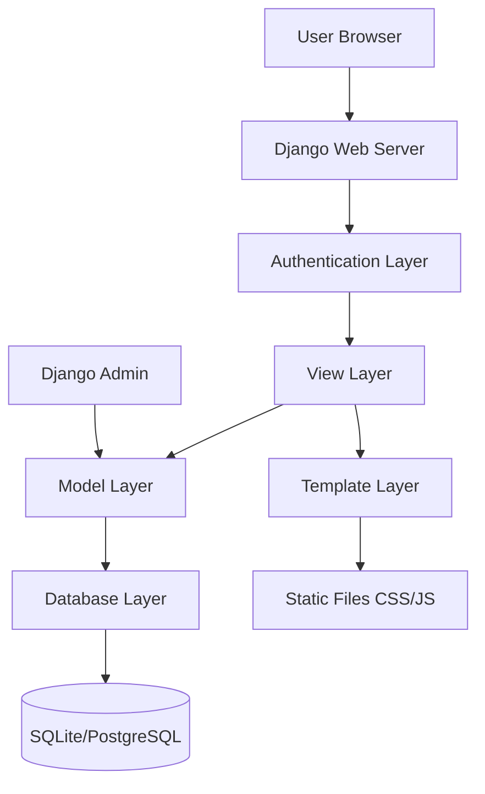
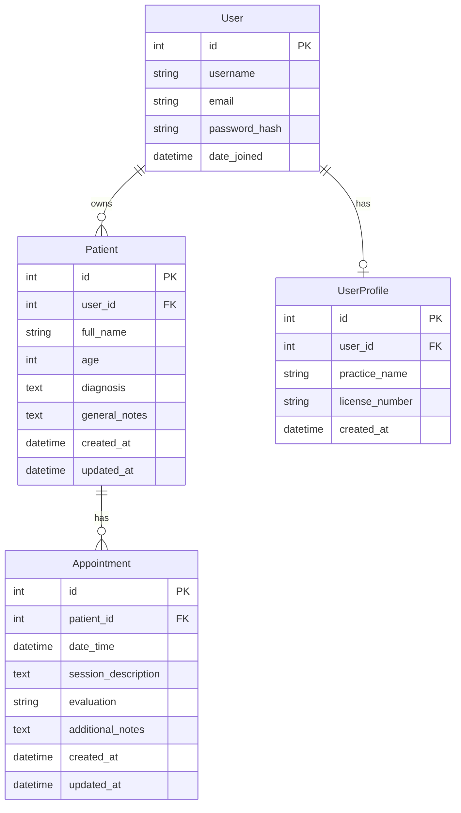

# Design Document

## Overview

MakiMotion is a Django-based web application that provides healthcare professionals with a comprehensive patient management system. The application follows Django's MVT (Model-View-Template) architecture and implements a clean, intuitive interface using the specified soft color palette. The system is designed for single-user operation initially but with a scalable architecture that can support multi-tenant functionality in the future.

## Architecture

### High-Level Architecture



### Application Structure

```
makimotion/
├── makimotion/
│   ├── __init__.py
│   ├── settings.py
│   ├── urls.py
│   └── wsgi.py
├── core/
│   ├── models.py
│   ├── views.py
│   ├── urls.py
│   ├── forms.py
│   └── admin.py
├── templates/
│   ├── base.html
│   ├── auth/
│   ├── dashboard/
│   └── patients/
├── static/
│   ├── css/
│   ├── js/
│   └── images/
├── requirements.txt
├── Procfile
└── render.yaml
```

## Components and Interfaces

### Authentication System

**Component:** Django's built-in authentication with custom login/logout views
- **Login View:** Custom template with MakiMotion branding
- **Logout View:** Secure session termination
- **Registration:** Optional, controlled by admin setting
- **Middleware:** Login required for all patient-related views

### Dashboard Component

**Component:** Main landing page after authentication
- **Patient List View:** Displays patient cards with sorting capabilities
- **Sorting Interface:** Toggle buttons for name and last appointment sorting
- **Search Functionality:** Quick patient lookup (future enhancement)
- **Navigation:** Access to patient creation and user logout

### Patient Management Component

**Component:** CRUD operations for patient records
- **Patient List View:** Grid/card layout of all patients
- **Patient Detail View:** Comprehensive patient information with appointment history
- **Patient Form View:** Create/edit patient information
- **Patient Delete View:** Confirmation dialog with cascade warning

### Appointment Management Component

**Component:** CRUD operations for patient appointments
- **Appointment List View:** Chronological display within patient context
- **Appointment Form View:** Create/edit appointment with validation
- **Appointment Detail View:** Full appointment information display
- **Calendar Integration:** Future enhancement for scheduling

## Data Models

### User Model
```python
# Using Django's built-in User model with potential extension
class UserProfile(models.Model):
    user = models.OneToOneField(User, on_delete=models.CASCADE)
    practice_name = models.CharField(max_length=200, blank=True)
    license_number = models.CharField(max_length=100, blank=True)
    created_at = models.DateTimeField(auto_now_add=True)
```

### Patient Model
```python
class Patient(models.Model):
    user = models.ForeignKey(User, on_delete=models.CASCADE)
    full_name = models.CharField(max_length=200)
    age = models.PositiveIntegerField()
    diagnosis = models.TextField()
    general_notes = models.TextField(blank=True)
    created_at = models.DateTimeField(auto_now_add=True)
    updated_at = models.DateTimeField(auto_now=True)
    
    class Meta:
        ordering = ['full_name']
```

### Appointment Model
```python
class Appointment(models.Model):
    EVALUATION_CHOICES = [
        ('excellent', 'Excellent Progress'),
        ('good', 'Good Progress'),
        ('fair', 'Fair Progress'),
        ('poor', 'Needs Attention'),
        ('critical', 'Critical Attention Required'),
    ]
    
    patient = models.ForeignKey(Patient, on_delete=models.CASCADE, related_name='appointments')
    date_time = models.DateTimeField()
    session_description = models.TextField()
    evaluation = models.CharField(max_length=20, choices=EVALUATION_CHOICES)
    additional_notes = models.TextField(blank=True)
    created_at = models.DateTimeField(auto_now_add=True)
    updated_at = models.DateTimeField(auto_now=True)
    
    class Meta:
        ordering = ['-date_time']
```

### Database Relationships



## User Interface Design

### Color Palette Implementation
```css
:root {
    --primary: #d1a0f8;     /* Soft lilac */
    --secondary: #f9c5d1;   /* Soft pink */
    --accent: #ffffff;      /* White */
    --neutral: #f4effa;     /* Neutral background */
    --contrast: #a86ef4;    /* Strong lilac for buttons */
    --error: #f87171;       /* Soft red for errors */
}
```

### Layout Structure
- **Header:** MakiMotion logo, user info, logout button
- **Navigation:** Minimal sidebar or top navigation
- **Main Content:** Card-based layout for patients and appointments
- **Footer:** Simple footer with version info

### Responsive Design
- **Desktop:** Full card grid layout
- **Tablet:** 2-column card layout
- **Mobile:** Single column stack layout

## Error Handling

### Form Validation
- **Client-side:** Basic HTML5 validation with custom styling
- **Server-side:** Django form validation with custom error messages
- **User Feedback:** Clear error messages using the defined error color

### Database Errors
- **Connection Issues:** Graceful degradation with user notification
- **Constraint Violations:** User-friendly error messages
- **Data Integrity:** Cascade delete warnings for patient removal

### Authentication Errors
- **Invalid Credentials:** Clear feedback without revealing user existence
- **Session Timeout:** Automatic redirect to login with message
- **Permission Denied:** Appropriate error pages

## Testing Strategy

### Unit Tests
- **Model Tests:** Validation, relationships, and business logic
- **View Tests:** Response codes, context data, and permissions
- **Form Tests:** Validation rules and error handling

### Integration Tests
- **User Workflows:** Complete patient and appointment management flows
- **Authentication:** Login/logout and permission enforcement
- **Database Operations:** CRUD operations with proper data isolation

### Test Data Management
- **Fixtures:** Sample data for development and testing
- **Factory Classes:** Dynamic test data generation
- **Database Isolation:** Separate test database configuration

### Performance Testing
- **Load Testing:** Patient list rendering with large datasets
- **Database Queries:** Optimization for appointment history views
- **Static File Serving:** CSS/JS delivery optimization

## Deployment Configuration

### Environment Settings
```python
# settings.py structure
DATABASES = {
    'default': {
        'ENGINE': 'django.db.backends.postgresql' if os.getenv('DATABASE_URL') else 'django.db.backends.sqlite3',
        'NAME': os.getenv('DATABASE_URL', BASE_DIR / 'db.sqlite3'),
    }
}

SECRET_KEY = os.getenv('SECRET_KEY', 'dev-key-only')
DEBUG = os.getenv('DEBUG', 'False').lower() == 'true'
ALLOWED_HOSTS = os.getenv('ALLOWED_HOSTS', 'localhost').split(',')
```

### Render Configuration
- **Procfile:** Web server startup command
- **render.yaml:** Service configuration with environment variables
- **requirements.txt:** Python dependencies with specific versions
- **Static Files:** WhiteNoise for static file serving

### Security Considerations
- **CSRF Protection:** Django's built-in CSRF middleware
- **SQL Injection:** Django ORM prevents SQL injection
- **XSS Protection:** Template auto-escaping enabled
- **HTTPS:** Enforced in production settings
- **Session Security:** Secure cookie settings for production

## Scalability Considerations

### Multi-User Architecture Preparation
- **User Isolation:** All patient queries filtered by user
- **Database Indexing:** Proper indexes on user foreign keys
- **Permission Framework:** Django's built-in permissions ready for extension

### Performance Optimization
- **Database Queries:** Select_related and prefetch_related for appointments
- **Caching:** Django's caching framework ready for implementation
- **Static Files:** CDN-ready static file configuration

### Future Enhancements
- **API Endpoints:** Django REST Framework integration points
- **Real-time Updates:** WebSocket integration preparation
- **Mobile App:** API-first design for mobile client support