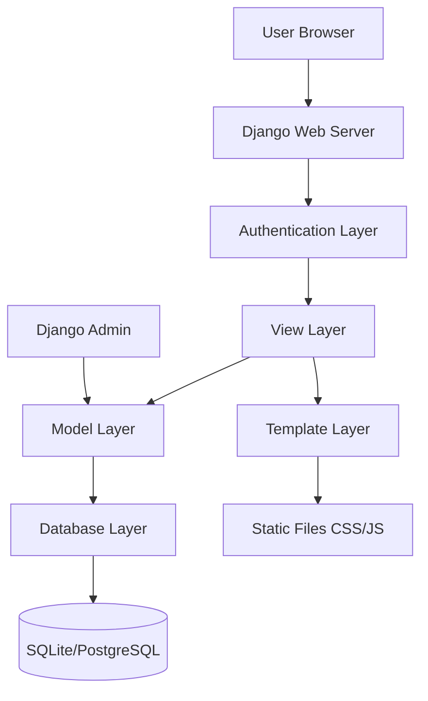
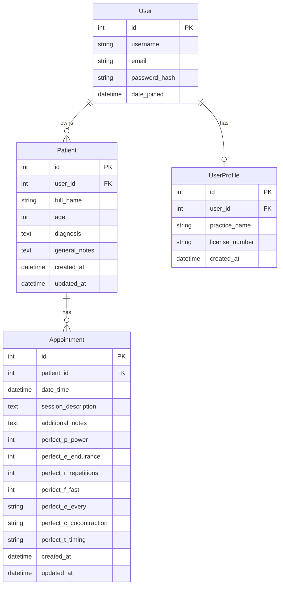

# Design Document

## Overview

MakiMotion is a Django-based web application that provides healthcare professionals, specifically pelvic floor specialists, with a comprehensive clinical records management system. The application follows Django's MVT (Model-View-Template) architecture and implements a clean, intuitive interface using the specified soft color palette. The system specializes in detailed clinical data collection across 9 major medical sections and includes advanced features like pregnancy tracking, floating navigation buttons, and comprehensive examination documentation. The system is designed for single-user operation initially but with a scalable architecture that can support multi-tenant functionality in the future.

## Architecture

### High-Level Architecture



### Application Structure

```
makimotion/
├── makimotion/
│   ├── __init__.py
│   ├── settings.py
│   ├── urls.py
│   └── wsgi.py
├── core/
│   ├── models.py
│   ├── views.py
│   ├── urls.py
│   ├── forms.py
│   └── admin.py
├── templates/
│   ├── base.html
│   ├── auth/
│   ├── dashboard/
│   └── patients/
├── static/
│   ├── css/
│   ├── js/
│   └── images/
├── requirements.txt
├── Procfile
└── render.yaml
```

## Components and Interfaces

### Authentication System

**Component:** Django's built-in authentication with custom login/logout views
- **Login View:** Custom template with MakiMotion branding
- **Logout View:** Secure session termination
- **Registration:** Optional, controlled by admin setting
- **Middleware:** Login required for all patient-related views

### Dashboard Component

**Component:** Main landing page after authentication
- **Patient List View:** Displays patient cards with sorting capabilities
- **Sorting Interface:** Toggle buttons for name and last appointment sorting
- **Search Functionality:** Quick patient lookup (future enhancement)
- **Navigation:** Access to patient creation and user logout

### Patient Management Component

**Component:** CRUD operations for patient records
- **Patient List View:** Grid/card layout of all patients
- **Patient Detail View:** Comprehensive patient information with appointment history
- **Patient Form View:** Create/edit patient information
- **Patient Delete View:** Confirmation dialog with cascade warning

### Appointment Management Component

**Component:** CRUD operations for patient appointments with PERFECT test assessment
- **Appointment List View:** Chronological display within patient context showing PERFECT test results
- **Appointment Form View:** Create/edit appointment with PERFECT test section and validation
- **Appointment Detail View:** Full appointment information display including formatted PERFECT scores
- **PERFECT Test Section:** Specialized form section with integer fields (P,E,R,F) and dropdown fields (E,C,T)
- **Calendar Integration:** Future enhancement for scheduling

## Clinical Data Architecture

### Medical Sections Organization

The clinical record is organized into 9 comprehensive sections:

1. **📋 Datos del Paciente** - Essential patient information and pregnancy tracking
2. **🩺 Antecedentes Ginecológicos** - Obstetric history, G-A-P system, surgical history
3. **🏃‍♀️ Hábitos de Vida** - Lifestyle factors affecting pelvic floor health
4. **💧 Función Urinaria** - Detailed urinary symptoms and patterns
5. **💦 Incontinencia Orina** - Incontinence classification (IUE, IUU, IUM) and assessment
6. **🦴 Funcionamiento Intestinal** - Bowel function, Bristol scale, evacuation patterns
7. **💕 Historial Sexual** - Sexual health and related symptoms
8. **🔍 Examen Físico** - Physical examination findings and reflex testing
9. **🔬 Examen Intracavitario** - MEA assessment, pain evaluation, muscle function
10. **🩻 Examen Coloproctológico** - Specialized coloproctologic examination

### Pregnancy Tracking System

The system implements automatic pregnancy week calculation:
- **Registration:** User inputs current weeks and preferred counting day
- **Calculation:** System calculates pregnancy start date based on registration data
- **Updates:** Automatic week calculation based on current date and counting day
- **Display:** Real-time pregnancy week display with flower emoji indicator

### Clinical Data Validation

- **Required Fields:** Name, age, consultation reason
- **Medical Validation:** Age ranges, Bristol scale (1-7), EVA pain scale (0-10)
- **Checkbox Logic:** Boolean fields for symptoms and examination findings
- **Text Fields:** Flexible text areas for detailed clinical notes

## Data Models

### User Model
```python
# Using Django's built-in User model with potential extension
class UserProfile(models.Model):
    user = models.OneToOneField(User, on_delete=models.CASCADE)
    practice_name = models.CharField(max_length=200, blank=True)
    license_number = models.CharField(max_length=100, blank=True)
    created_at = models.DateTimeField(auto_now_add=True)
```

### Patient Model
```python
class Patient(models.Model):
    """Comprehensive clinical record for pelvic floor patients"""
    user = models.ForeignKey(User, on_delete=models.CASCADE)
    
    # Essential Patient Data
    full_name = models.CharField(max_length=200)
    age = models.PositiveIntegerField()
    profession = models.CharField(max_length=100, blank=True)
    address = models.TextField(blank=True)
    phone = models.CharField(max_length=20, blank=True)
    consultation_reason = models.TextField()
    medications = models.TextField(blank=True)
    musculoskeletal_history = models.TextField(blank=True)
    patient_data_other = models.TextField(blank=True)
    
    # Pregnancy Tracking
    is_pregnant = models.BooleanField(default=False)
    pregnancy_weeks_at_registration = models.PositiveIntegerField(null=True, blank=True)
    pregnancy_week_day = models.CharField(max_length=10, choices=WEEKDAY_CHOICES, blank=True)
    pregnancy_registration_date = models.DateField(null=True, blank=True)
    
    # Gynecological History (G-A-P system, delivery details, surgical history)
    menopause = models.CharField(max_length=10, choices=YES_NO_CHOICES, blank=True)
    pregnancies_g = models.PositiveIntegerField(null=True, blank=True)
    abortions_a = models.PositiveIntegerField(null=True, blank=True)
    losses_p = models.PositiveIntegerField(null=True, blank=True)
    delivery_type = models.CharField(max_length=50, blank=True)
    episiotomies = models.CharField(max_length=10, choices=YES_NO_CHOICES, blank=True)
    # ... additional gynecological fields
    gynecological_other = models.TextField(blank=True)
    
    # Lifestyle Habits
    smoking = models.CharField(max_length=10, choices=YES_NO_CHOICES, blank=True)
    alcohol = models.CharField(max_length=10, choices=YES_NO_CHOICES, blank=True)
    physical_activity = models.TextField(blank=True)
    lifestyle_other = models.TextField(blank=True)
    
    # Urinary Function (detailed symptom tracking)
    daily_frequency = models.CharField(max_length=50, blank=True)
    pollakiuria = models.BooleanField(default=False)
    nocturia = models.BooleanField(default=False)
    urgency = models.BooleanField(default=False)
    # ... additional urinary symptoms
    urinary_function_other = models.TextField(blank=True)
    
    # Incontinence Classification
    iue = models.BooleanField(default=False)  # Stress incontinence
    iuu = models.BooleanField(default=False)  # Urge incontinence
    ium = models.BooleanField(default=False)  # Mixed incontinence
    
    # Bowel Function (Bristol scale, evacuation patterns)
    constipation = models.BooleanField(default=False)
    bristol_scale = models.PositiveIntegerField(null=True, blank=True)
    position_frequency = models.TextField(blank=True)
    bowel_function_other = models.TextField(blank=True)
    
    # Sexual History
    sexual_status = models.CharField(max_length=10, choices=SEXUAL_STATUS_CHOICES, blank=True)
    dyspareunia = models.BooleanField(default=False)
    sexual_history_other = models.TextField(blank=True)
    
    # Physical Examination
    diastasis = models.TextField(blank=True)
    ncp_tone_contraction = models.TextField(blank=True)
    anal_cutaneous_reflex = models.CharField(max_length=10, choices=YES_NO_CHOICES, blank=True)
    physical_exam_other = models.TextField(blank=True)
    
    # Intracavitary Examination
    intracavitary_consent = models.BooleanField(default=False)
    mea_tonicity_rest = models.TextField(blank=True)
    mea_pain_eva = models.PositiveIntegerField(null=True, blank=True)
    oxford_force = models.TextField(blank=True)
    superficial_musculature = models.TextField(blank=True)
    intracavitary_exam_other = models.TextField(blank=True)
    
    # Coloproctologic Examination
    coloproctologic_consent = models.BooleanField(default=False)
    oxford_notes = models.TextField(blank=True)
    thoracic_rectal_synchronization = models.BooleanField(default=False)
    coloproctologic_exam_other = models.TextField(blank=True)
    
    created_at = models.DateTimeField(auto_now_add=True)
    updated_at = models.DateTimeField(auto_now=True)
    
    def get_current_pregnancy_weeks(self):
        """Calculate current pregnancy weeks based on registration data"""
        # Implementation for automatic week calculation
        pass
    
    class Meta:
        ordering = ['full_name']
        verbose_name = "Ficha Clínica"
        verbose_name_plural = "Fichas Clínicas"
```

### Appointment Model
```python
class Appointment(models.Model):
    YES_NO_CHOICES = [
        ('si', 'Sí'),
        ('no', 'No'),
    ]
    
    patient = models.ForeignKey(Patient, on_delete=models.CASCADE, related_name='appointments')
    date_time = models.DateTimeField()
    session_description = models.TextField()
    additional_notes = models.TextField(blank=True)
    
    # PERFECT Test Fields
    perfect_p_power = models.PositiveIntegerField(null=True, blank=True, help_text="P - Power (Fuerza)")
    perfect_e_endurance = models.PositiveIntegerField(null=True, blank=True, help_text="E - Endurance (Resistencia)")
    perfect_r_repetitions = models.PositiveIntegerField(null=True, blank=True, help_text="R - Repetitions (Repeticiones)")
    perfect_f_fast = models.PositiveIntegerField(null=True, blank=True, help_text="F - Fast contractions (Contracciones rápidas)")
    perfect_e_every = models.CharField(max_length=10, choices=YES_NO_CHOICES, blank=True, help_text="E - Every contraction (Cada contracción)")
    perfect_c_cocontraction = models.CharField(max_length=10, choices=YES_NO_CHOICES, blank=True, help_text="C - Co-contraction (Co-contracción)")
    perfect_t_timing = models.CharField(max_length=10, choices=YES_NO_CHOICES, blank=True, help_text="T - Timing (Coordinación)")
    
    created_at = models.DateTimeField(auto_now_add=True)
    updated_at = models.DateTimeField(auto_now=True)
    
    def get_perfect_score_display(self):
        """Return formatted PERFECT test results"""
        return {
            'P': self.perfect_p_power,
            'E': self.perfect_e_endurance,
            'R': self.perfect_r_repetitions,
            'F': self.perfect_f_fast,
            'E2': self.perfect_e_every,
            'C': self.perfect_c_cocontraction,
            'T': self.perfect_t_timing,
        }
    
    class Meta:
        ordering = ['-date_time']
```

### Database Relationships



## User Interface Design

### Color Palette Implementation
```css
:root {
    --primary: #d1a0f8;     /* Soft lilac */
    --secondary: #f9c5d1;   /* Soft pink */
    --accent: #ffffff;      /* White */
    --neutral: #f4effa;     /* Neutral background */
    --contrast: #a86ef4;    /* Strong lilac for buttons */
    --error: #f87171;       /* Soft red for errors */
}
```

### Clinical Form Design
- **Sectioned Layout:** 9 major clinical sections with clear visual separation
- **Subsections:** Nested subsections for detailed medical categories
- **Checkbox Groups:** Organized symptom and examination checkboxes
- **Medical Icons:** Section-specific emojis for quick visual identification
- **Floating Actions:** Fixed-position buttons for long form navigation

### Floating Navigation System
```css
.floating-actions {
    position: fixed;
    top: 50%;
    right: 30px;
    transform: translateY(-50%);
    z-index: 9999;
    background: rgba(255, 255, 255, 0.95);
    backdrop-filter: blur(10px);
}
```

### Layout Structure
- **Header:** MakiMotion logo, user info, logout button
- **Clinical Forms:** Multi-section forms with floating action buttons
- **Main Content:** Card-based layout for patients and appointments
- **Footer:** Simple footer with version info

### Responsive Design
- **Desktop:** Full form layout with floating buttons
- **Tablet:** Condensed form layout, floating buttons hidden
- **Mobile:** Single column stack layout, standard form buttons
- **Mobile:** Single column stack layout

## Error Handling

### Form Validation
- **Client-side:** Basic HTML5 validation with custom styling
- **Server-side:** Django form validation with custom error messages
- **User Feedback:** Clear error messages using the defined error color

### Database Errors
- **Connection Issues:** Graceful degradation with user notification
- **Constraint Violations:** User-friendly error messages
- **Data Integrity:** Cascade delete warnings for patient removal

### Authentication Errors
- **Invalid Credentials:** Clear feedback without revealing user existence
- **Session Timeout:** Automatic redirect to login with message
- **Permission Denied:** Appropriate error pages

## Testing Strategy

### Unit Tests
- **Model Tests:** Validation, relationships, and business logic
- **View Tests:** Response codes, context data, and permissions
- **Form Tests:** Validation rules and error handling

### Integration Tests
- **User Workflows:** Complete patient and appointment management flows
- **Authentication:** Login/logout and permission enforcement
- **Database Operations:** CRUD operations with proper data isolation

### Test Data Management
- **Fixtures:** Sample data for development and testing
- **Factory Classes:** Dynamic test data generation
- **Database Isolation:** Separate test database configuration

### Performance Testing
- **Load Testing:** Patient list rendering with large datasets
- **Database Queries:** Optimization for appointment history views
- **Static File Serving:** CSS/JS delivery optimization

## Deployment Configuration

### Environment Settings
```python
# settings.py structure
DATABASES = {
    'default': {
        'ENGINE': 'django.db.backends.postgresql' if os.getenv('DATABASE_URL') else 'django.db.backends.sqlite3',
        'NAME': os.getenv('DATABASE_URL', BASE_DIR / 'db.sqlite3'),
    }
}

SECRET_KEY = os.getenv('SECRET_KEY', 'dev-key-only')
DEBUG = os.getenv('DEBUG', 'False').lower() == 'true'
ALLOWED_HOSTS = os.getenv('ALLOWED_HOSTS', 'localhost').split(',')
```

### Render Configuration
- **Procfile:** Web server startup command
- **render.yaml:** Service configuration with environment variables
- **requirements.txt:** Python dependencies with specific versions
- **Static Files:** WhiteNoise for static file serving

### Security Considerations
- **CSRF Protection:** Django's built-in CSRF middleware
- **SQL Injection:** Django ORM prevents SQL injection
- **XSS Protection:** Template auto-escaping enabled
- **HTTPS:** Enforced in production settings
- **Session Security:** Secure cookie settings for production

## Scalability Considerations

### Multi-User Architecture Preparation
- **User Isolation:** All patient queries filtered by user
- **Database Indexing:** Proper indexes on user foreign keys
- **Permission Framework:** Django's built-in permissions ready for extension

### Performance Optimization
- **Database Queries:** Select_related and prefetch_related for appointments
- **Caching:** Django's caching framework ready for implementation
- **Static Files:** CDN-ready static file configuration

### Future Enhancements
- **API Endpoints:** Django REST Framework integration points
- **Real-time Updates:** WebSocket integration preparation
- **Mobile App:** API-first design for mobile client support